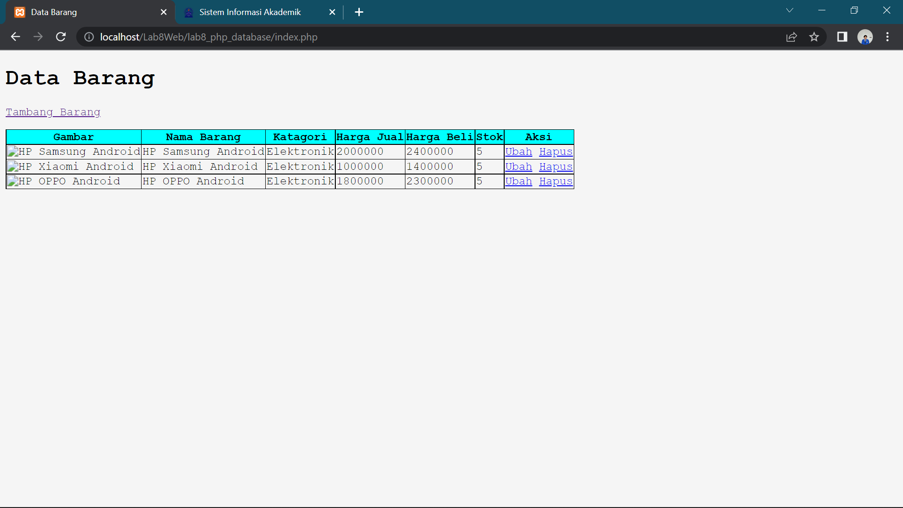
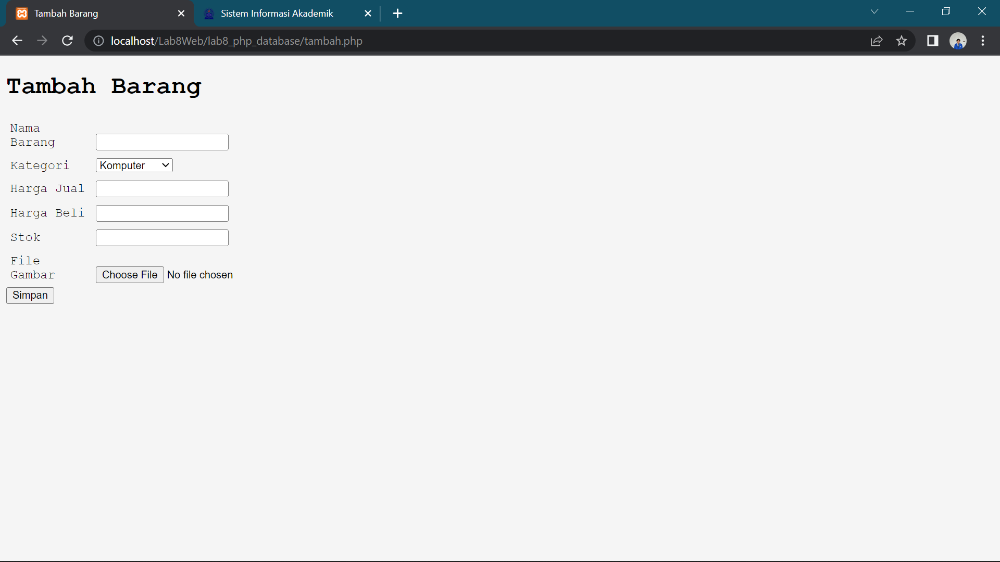
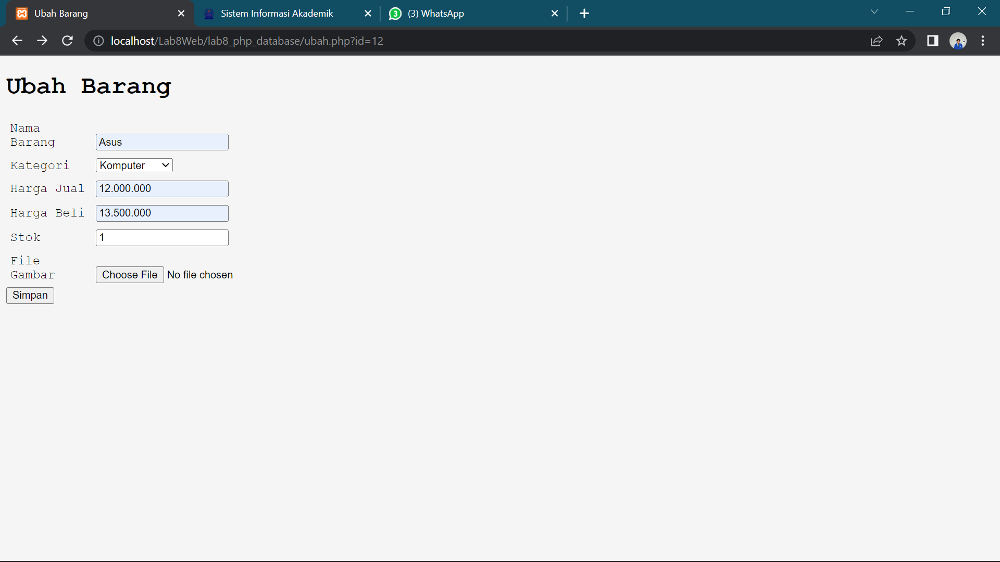

| Ziddan Makarim |    312010063    |
|----------------|-----------------|
|   TI.20 A.1    | Pemrograman Web |

# Lab8Web
## Praktikum 8

Dalam praktikum 8 ini akan memahami konsep dasar CRUD dan membuat program CRUD sederhana menggunakan PHP

## Langkah - langkah praktikum

## 1). Menjalankan MySQL


Pastikan webserver Apache dan MySQL server sudah dijalankan. Kemudian buka
melalui browser: http://localhost/phpmyadmin/

## 2). Membuat Database

```mysql
CREATE DATABASE latihan1;
```

## 3). Membuat Tabel
```mysql
CREATE TABLE data_barang (
id_barang int(10) auto_increment Primary Key,
kategori varchar(30),
nama varchar(30),
gambar varchar(100),
harga_beli decimal(10,0),
harga_jual decimal(10,0),
stok int(4)
);
```
Dengan hasil run seperti gambar dibawah


## 4). Menambahkan Data

Berikut hasil run


## 5). Membuat Program CRUD
Buatlah folder lab8_php_database pada root directory web server (C:\xampp\htdocs)

Kemudian untuk mengakses direktory tersebut pada web server dengan mengakses URL: http://localhost/Lab8Web/lab8_php_database/


## 6). Membuat File Koneksi Database
Buat file baru bernama koneksi.php

Jika seperti artinya koneksi berhasil
### Contoh Coding
```php
<?php
$host = "localhost";
$user = "root";
$pass = "";
$db = "latihan1";

$conn = mysqli_connect($host, $user, $pass, $db);
if ($conn == false)
{
    echo "Koneksi ke server gagal.";
    die();
} else echo "Koneksi berhasil";
?>
```

## 7). Membuat file index untuk menampilkan data (Read)
Buat file baru bernama index.php


### Contoh Coding
```php
<?php
include("koneksi.php");

// query untuk menampilkan data
$sql = 'SELECT * FROM data_barang';
$result = mysqli_query($conn, $sql);

?>
```
```html
<!DOCTYPE html>
<html lang="en">
<head>
    <meta charset="UTF-8">
    <link href="style.css" rel="stylesheet" type="text/css" />
    <title>Data Barang</title>
</head>
<body>
    <div class="container">
        <h1>Data Barang</h1>
        <div class="main">
            <a href="tambah.php">Tambang Barang</a>
            <table>
            <tr>
                <th>Gambar</th>
                <th>Nama Barang</th>
                <th>Katagori</th>
                <th>Harga Jual</th>
                <th>Harga Beli</th>
                <th>Stok</th>
                <th>Aksi</th>
            </tr>
            <?php if($result): ?>
            <?php while($row = mysqli_fetch_array($result)): ?>
            <tr>
                <td>" alt="<?=
$row['nama'];?>"></td>
                <td><?= $row['nama'];?></td>
                <td><?= $row['kategori'];?></td>
                <td><?= $row['harga_beli'];?></td>
                <td><?= $row['harga_jual'];?></td>
                <td><?= $row['stok'];?></td>
                <td>
                <a href="ubah.php?id=<?= $row['id_barang'];?>">Ubah</a>
                <a href="hapus.php?id=<?= $row['id_barang'];?>">Hapus</a> 
                </td>
            </tr>
            <?php endwhile; else: ?>
            <tr>
                <td colspan="7">Belum ada data</td>
            </tr>
            <?php endif; ?>
            </table>
        </div>
    </div>
</body>
</html>
```
Dengan menambahkan css
```css
body{
    background-color: whitesmoke;
    font-family: 'Courier New', Courier, monospace;
}
table{
    border-collapse: collapse;
    margin-top: 15px;
}
th{
    background-color: aqua;
}
th,td{
    border: 1px solid black;
}
```

## 8). Menambah Data
Buat file baru dengan nama tambah.php

### Contoh Coding
```php
<?php
error_reporting(E_ALL);
include_once 'koneksi.php';

if (isset($_POST['submit']))
{
    $nama = $_POST['nama'];
    $kategori = $_POST['kategori'];
    $harga_jual = $_POST['harga_jual'];
    $harga_beli = $_POST['harga_beli'];
    $stok = $_POST['stok'];
    $file_gambar = $_FILES['file_gambar'];
    $gambar = null;
    if ($file_gambar['error'] == 0)
    {
        $filename = str_replace(' ', '_',$file_gambar['name']);
        $destination = dirname(__FILE__) .'/gambar/' . $filename;
        if(move_uploaded_file($file_gambar['tmp_name'], $destination))
        {
            $gambar = 'gambar/' . $filename;;
        }
    }
    $sql = 'INSERT INTO data_barang (nama, kategori,harga_jual, harga_beli,
stok, gambar) ';
    $sql .= "VALUE ('{$nama}', '{$kategori}','{$harga_jual}',
'{$harga_beli}', '{$stok}', '{$gambar}')";
    $result = mysqli_query($conn, $sql);
    header('location: index.php');
}
?>
```
```html
<!DOCTYPE html>
<html lang="en">
<head>
    <meta charset="UTF-8">
    <link href="style.css" rel="stylesheet" type="text/css" />
    <title>Tambah Barang</title>
</head>
<body>
<div class="container">
    <h1>Tambah Barang</h1>
    <div class="main">
        <form method="post" action="tambah.php"
enctype="multipart/form-data">
        <div class="input">
            <label>Nama Barang</label>
            <input type="text" name="nama" />
        </div>
        <div class="input">
            <label>Kategori</label>
            <select name="kategori">
                <option value="Komputer">Komputer</option>
                <option value="Elektronik">Elektronik</option>
                <option value="Hand Phone">Hand Phone</option>
<           </select>
        </div>
        <div class="input">
            <label>Harga Jual</label>
            <input type="text" name="harga_jual" />
        </div>
        <div class="input">
            <label>Harga Beli</label>
            <input type="text" name="harga_beli" />
        </div>
        <div class="input">
            <label>Stok</label>
            <input type="text" name="stok" />
        </div>
        <div class="input">
            <label>File Gambar</label>
            <input type="file" name="file_gambar" />
        </div>
        <div class="submit">
            <input type="submit" name="submit" value="Simpan" />
        </div>
      </form>
    </div>
</div>
</body>
</html>
```
Dengan menggunakan css
```css
.input{
    padding: 5px;
}
.input label{
    display: inline-block;
    width: 100px;
}
```

## 9). Mengubah Data (Update)
Buat file baru dengan nama ubah.php

### Contoh Coding
```php
<?php
error_reporting(E_ALL);
include_once 'koneksi.php';

if (isset($_POST['submit']))
{
    $id = $_POST['id'];
    $nama = $_POST['nama'];
    $kategori = $_POST['kategori'];
    $harga_jual = $_POST['harga_jual'];
    $harga_beli = $_POST['harga_beli'];
    $stok = $_POST['stok'];
    $file_gambar = $_FILES['file_gambar'];
    $gambar = null;

    if ($file_gambar['error'] == 0)
    {
        $filename = str_replace(' ', '_', $file_gambar['name']);
        $destination = dirname(__FILE__) . '/gambar/' . $filename;
        if (move_uploaded_file($file_gambar['tmp_name'], $destination)) 
        {
            $gambar = 'gambar/' . $filename;;
        }
    }
    
    $sql = 'UPDATE data_barang SET ';
    $sql .= "nama = '{$nama}', kategori = '{$kategori}', ";
    $sql .= "harga_jual = '{$harga_jual}', harga_beli = '{$harga_beli}', stok
= '{$stok}' ";
    if (!empty($gambar))
        $sql .= ", gambar = '{$gambar}' ";
    $sql .= "WHERE id_barang = '{$id}'";
    $result = mysqli_query($conn, $sql);

    header('location: index.php');
}
//$id = $_GET['id'];
$id = (isset($_POST['id']) ? $_POST['id'] : '');
$sql = "SELECT * FROM data_barang WHERE id_barang = '{$id}'";
$result = mysqli_query($conn, $sql);
if (!$result) die('Error: Data tidak tersedia');
$data = mysqli_fetch_array($result);

function is_select($var, $val) {
    if ($var == $val) return 'selected="selected"';
    return false;
}
?>
```
```html
<!DOCTYPE html>
<html lang="en">
<head>
    <meta charset="UTF-8">
    <link href="style.css" rel="stylesheet" type="text/css" />  
    <title>Ubah Barang</title>
</head>
<body>
<div class="container">
    <h1>Ubah Barang</h1>
    <div class="main">
        <form method="post" action="ubah.php"
enctype="multipart/form-data">
            <div class="input">
                <label>Nama Barang</label>
                <input type="text" name="nama" value="<?php echo
$data['nama'];?>" />
            </div>
            <div class="input">
                <label>Kategori</label>
                <select name="kategori">
                <option <?php echo is_select
('Komputer', $data['kategori']);?> value="Komputer">Komputer</option>
                <option <?php echo is_select
('Komputer', $data['kategori']);?> value="Elektronik">Elektronik</option>
                <option <?php echo is_select
('Komputer', $data['kategori']);?> value="Hand Phone">Hand Phone</option>
            </select>
            </div>
            <div class="input">
                <label>Harga Jual</label>
                <input type="text" name="harga_jual" value="<?php echo
$data['harga_jual'];?>" />
            </div>
            <div class="input">
                <label>Harga Beli</label>
                <input type="text" name="harga_beli" value="<?php echo
$data['harga_beli'];?>" />
            </div>
            <div class="input">
                <label>Stok</label>
                <input type="text" name="stok" value="<?php echo
$data['stok'];?>" />
            </div>
            <div class="input">
                <label>File Gambar</label>
                <input type="file" name="file_gambar" />
            </div>
            <div class="submit">
                <input type="hidden" name="id" value="<?php echo
$data['id_barang'];?>" />
                <input type="submit" name="submit" value="Simpan" />
            </div>
        </form>
    </div>
</div>
</body>
</html>
```

## 10). Menghapus Data (Delete)
Jika ingin menghapus data klik hapus pada index table maka akan terhapus secara otomatis oleh program.

### Contoh Coding
```php
<?php
include_once 'koneksi.php';
$id = $_GET['id'];
$sql = "DELETE FROM data_barang WHERE id_barang = '{$id}'";
$result = mysqli_query($conn, $sql);
header('location: index.php');
?>
```

# SEKIAN DAN TERIMA KASIH
