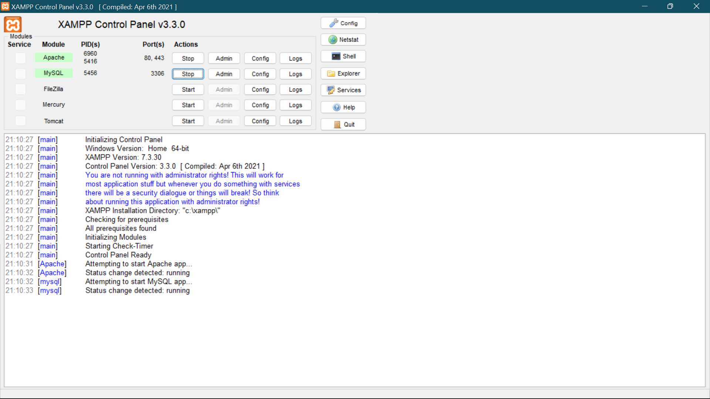
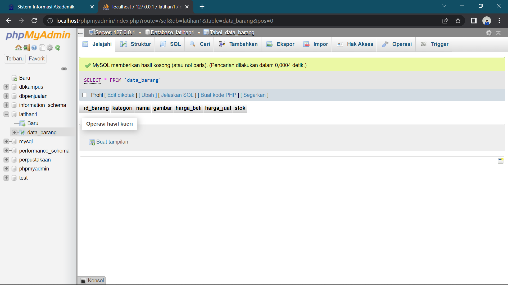
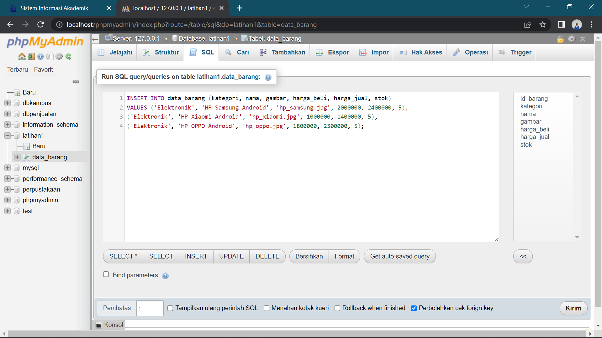
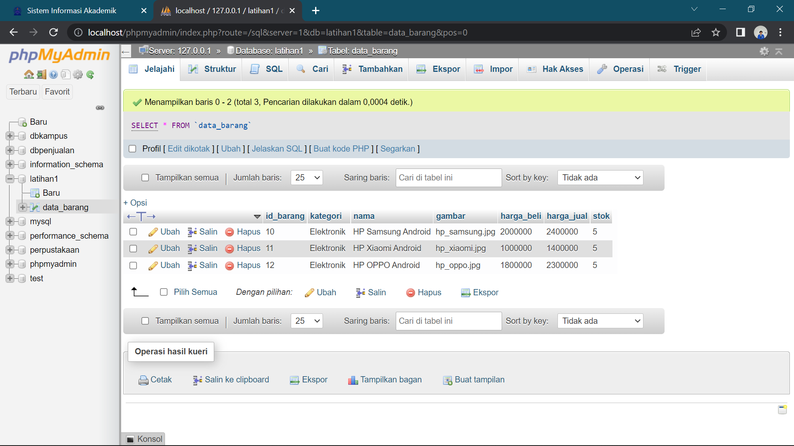
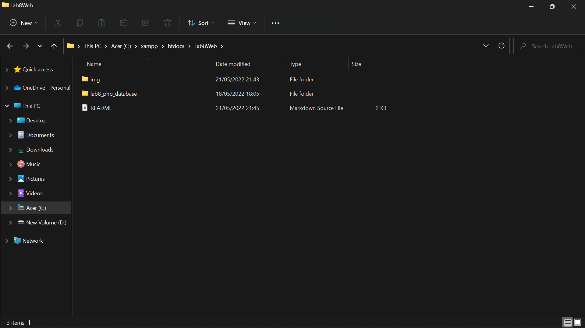
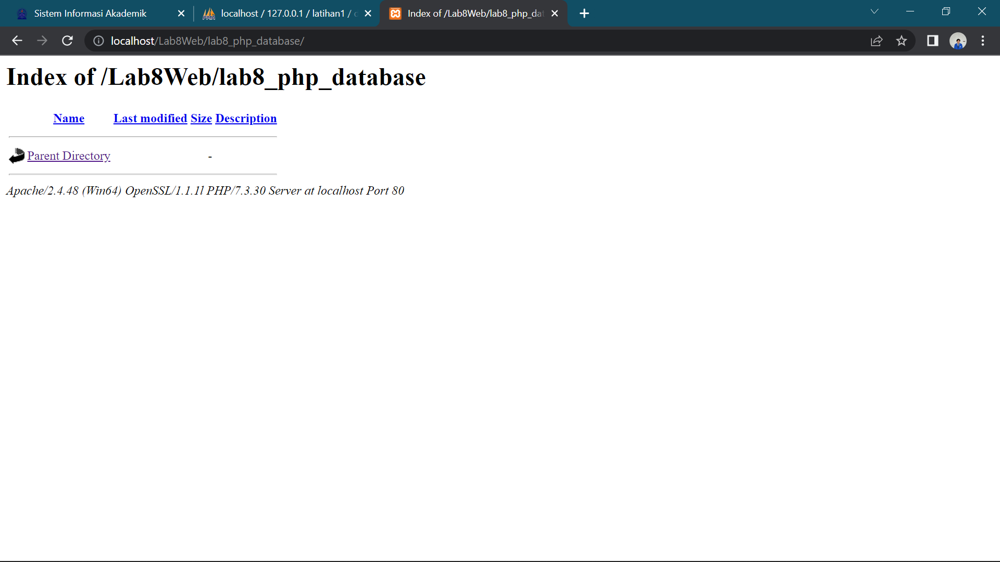
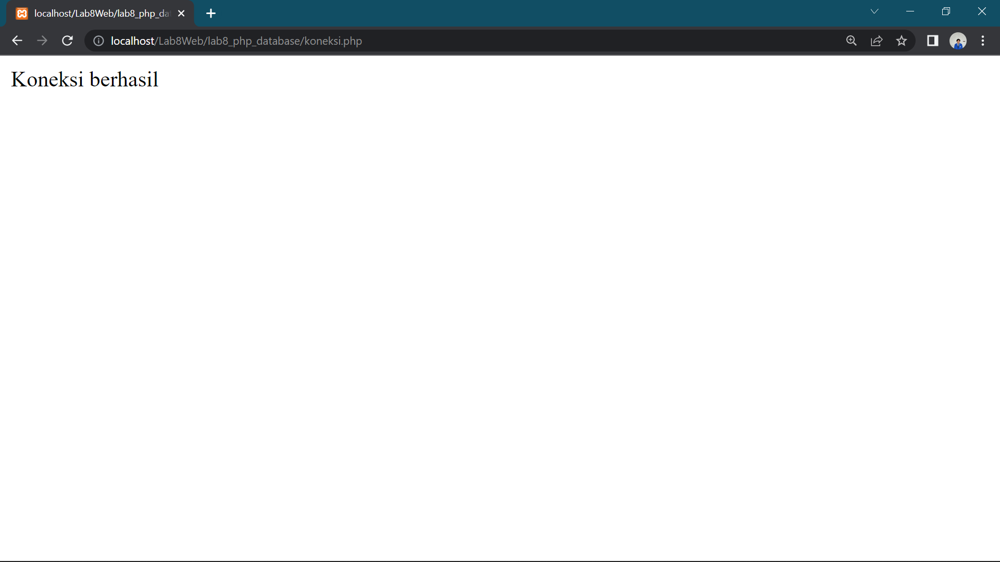

| Ziddan Makarim |    312010063    |
|----------------|-----------------|
|   TI.20 A.1    | Pemrograman Web |

# Lab8Web
## Praktikum 8

Dalam praktikum 8 ini akan memahami konsep dasar CRUD dan membuat program CRUD sederhana menggunakan PHP

## Langkah - langkah praktikum

## 1). Menjalankan MySQL


Pastikan webserver Apache dan MySQL server sudah dijalankan. Kemudian buka
melalui browser: http://localhost/phpmyadmin/

## 2). Membuat Database

```mysql
CREATE DATABASE latihan1;
```

## 3). Membuat Tabel
```mysql
CREATE TABLE data_barang (
id_barang int(10) auto_increment Primary Key,
kategori varchar(30),
nama varchar(30),
gambar varchar(100),
harga_beli decimal(10,0),
harga_jual decimal(10,0),
stok int(4)
);
```
Dengan hasil run seperti gambar dibawah


## 4). Menambahkan Data

Berikut hasil run


## 5). Membuat Program CRUD
Buatlah folder lab8_php_database pada root directory web server (C:\xampp\htdocs)

Kemudian untuk mengakses direktory tersebut pada web server dengan mengakses URL: http://localhost/Lab8Web/lab8_php_database/


## 6). Membuat File Koneksi Database
Buat file baru bernama koneksi.php

Jika seperti artinya koneksi berhasil
### Contoh Coding
```mysql
<?php
$host = "localhost";
$user = "root";
$pass = "";
$db = "latihan1";

$conn = mysqli_connect($host, $user, $pass, $db);
if ($conn == false)
{
    echo "Koneksi ke server gagal.";
    die();
} else echo "Koneksi berhasil";
?>
```

## 7). Membuat file index untuk menampilkan data (Read)
Buat file baru bernama index.php
